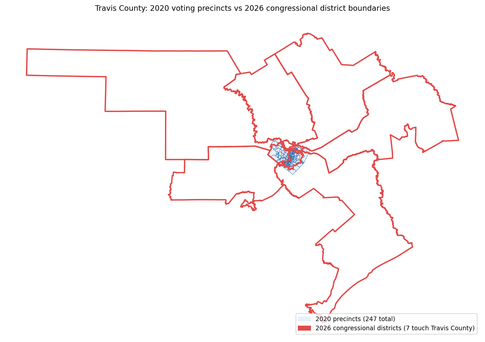
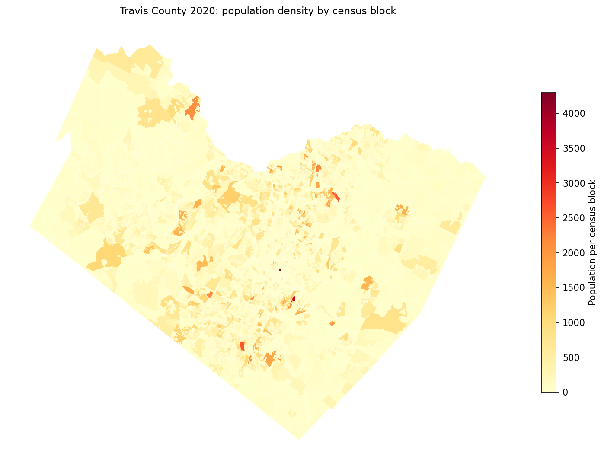
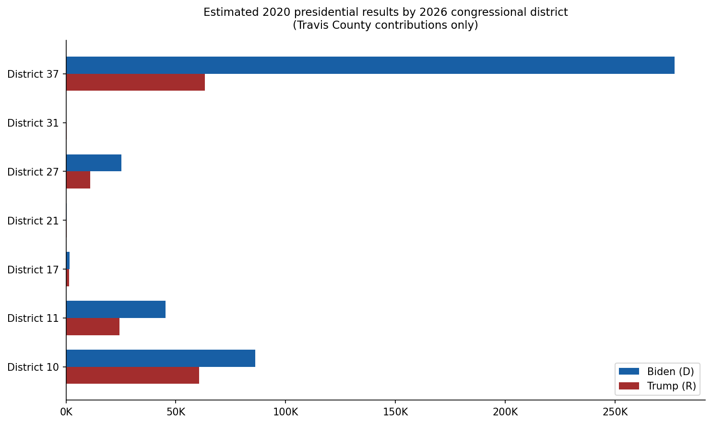

# Methodology

> **Note:** This document is a working draft and actively being developed. Content is accurate but language and structure are still being refined. If you have questions or suggestions, please comment on Issue #8.

## The core problem

When states redraw their political maps, directly comparing election results across cycles becomes challenging. You are looking at different slices of the population each time. A district might appear more Republican or Democratic simply because different neighborhoods got added or removed, not because of any real shift in how people voted.

This project aims to translate past election results onto current maps so campaigns can see how any district or neighborhood has genuinely trended over time. We are starting with Texas, where a 2025 mid-decade redraw created an urgent need for exactly this kind of historical context.

### Why this matters

By standardizing historical votes onto today's exact district and precinct boundaries, this pipeline gives campaigns three vital advantages:

- Unmasking map changes: quantifies exactly who a new map helps or hurts before a single new ballot is cast.
- Neighborhood-level trends: bypasses years of messy, shifting precinct lines to reveal clear, multi-cycle political trajectories for stable geographic communities.
- Resource precision: stops campaigns from wasting limited time and money based on obsolete boundaries, shifting field strategy from guesswork to evidence-backed analysis.

## Two approaches: area-weighted vs population-weighted

When a precinct straddles a district boundary, you have to decide how to split its votes. There are two ways to do this.

The simple approach is area-weighted interpolation: if 70% of the precinct's land area falls inside District A, give District A 70% of the votes. This is easy to calculate but often wrong. Land does not vote — people do. A precinct that is 70% farmland and 30% dense suburb should not have its votes split 70/30.

The better approach is population-weighted interpolation, which is what this project uses. Instead of splitting by land area, we split by where people actually live. We use Census block population counts to figure out what fraction of each precinct's residents fall inside each district, then use those fractions to allocate votes.

The result is a more accurate estimate of how each district would have voted if those boundaries had existed during past elections.

## How it works: a step-by-step example

Imagine Travis County has three precincts and two new congressional districts. Here is how the calculation works.

**Step 1 — Gather the three ingredients**

- Precinct boundaries (the old map)
- Congressional district boundaries (the new map)
- Census block population counts (where people live)

**Step 2 — Overlay census blocks onto both maps**

Each census block is a tiny geographic unit — smaller than a city block in dense areas. Every block sits inside exactly one precinct and exactly one congressional district. By tagging each block with both its precinct ID and its district ID, we know which district each block's population belongs to.

**Step 3 — Calculate population weights**

For each precinct, add up the population of all blocks that fall in each district. Divide by the total precinct population to get a weight.

Example:
- Precinct 14 has 2,000 people total
- 1,800 people live in the part that falls in District B
- 200 people live in the part that falls in District A
- Weight for District B: 1,800 / 2,000 = 0.90
- Weight for District A: 200 / 2,000 = 0.10

**Step 4 — Allocate votes and validate**

Multiply each precinct's vote totals by the weights.

Example:
- Precinct 14 gave Candidate X 1,200 votes
- District B gets: 1,200 x 0.90 = 1,080 votes
- District A gets: 1,200 x 0.10 = 120 votes

Repeat for every precinct and every candidate, then sum by district. The total votes for each candidate across all districts must exactly match the original precinct-level totals. If any votes are created or lost, something went wrong.

## Key assumptions

**Census blocks are internally homogeneous.** We assume that everyone within a census block votes at the same rate and in the same proportion as the block as a whole. In reality, one side of a block might be an apartment complex and the other a parking lot. The smaller the block, the safer this assumption.

**The 2020 Census accurately reflects who was living in each block at the time of the elections being analyzed.** Population shifts between census years are not captured. A neighborhood that grew rapidly between 2020 and 2024 will have its population underrepresented in our weights.

**Voter turnout is uniform across a precinct.** We allocate votes proportionally to population, not to registered voters or actual turnout. A census block with 500 residents gets 5x the weight of one with 100 residents, even if the smaller block has higher turnout.

## Known limitations and edge cases

**Mid-decade population shifts.** The 2020 Census data we use reflects where people lived in 2020. By 2024, some neighborhoods had grown significantly and others had shrunk. Our weights do not capture this. Results for elections further from 2020 carry more uncertainty.

**Zero-population census blocks.** Some blocks have no residents — parking lots, industrial areas, parks. These blocks are assigned a weight of zero and do not affect the allocation. This is handled correctly in the code but worth knowing.

**Precincts that span county lines.** Our pilot covers Travis County only. In the statewide scaling phase, precincts that cross county boundaries will need special handling since our data is organized by county.

**Very small precincts.** Precincts with very few residents (under 50 people) are statistically noisy. A small change in how their boundaries are drawn can significantly affect the weight calculation. Results for these precincts should be interpreted carefully.

**Boundary litigation.** The 2026 congressional district boundaries (PlanC2333) were subject to ongoing legal challenges as of early 2026. If the boundaries change as a result of court orders, the weights would need to be recalculated.

## Data sources

All data used in the Travis County pilot is publicly available and free to download.

### Boundary files

2020 precinct boundaries: Texas Legislative Council Capitol Data Portal
https://data.capitol.texas.gov/dataset/precincts
File: precincts20g_2020.zip

2026 congressional district boundaries (PlanC2333): Texas Legislative Council Capitol Data Portal
https://data.capitol.texas.gov/dataset/planc2333
File: PLANC2333.zip
Note: enacted by the 89th Legislature, 2nd C.S., 2025. Subject to ongoing litigation as of early 2026.

### Census population data

2020 Census P.L. 94-171 Redistricting File: U.S. Census Bureau
https://www2.census.gov/programs-surveys/decennial/2020/data/01-Redistricting_File--PL_94-171/Texas/
File: tx2020.pl.zip

2020 Census block geometries and population: Texas Legislative Council Capitol Data Portal
https://data.capitol.texas.gov/dataset/2020-census-geography
Files: Blocks.zip (geometries), Blocks_Pop.zip (population and demographics)

### Election results

2020 Presidential precinct-level results: Voting and Election Science Team (VEST), Harvard Dataverse
https://dataverse.harvard.edu/dataset.xhtml?persistentId=doi:10.7910/DVN/K7760H
File: tx_2020.zip

## Validation approach

Two checks are run to confirm the results are correct. Both must pass before the output is considered reliable.

### Weight-sum test

For every precinct with a non-zero population, the weights assigned to its district fragments must sum to exactly 1.0. If they sum to less than 1.0, some population is being lost. If they sum to more than 1.0, population is being double-counted.

In the Travis County pilot, 245 of 247 precincts passed this test. The two that did not are zero-population precincts where dividing zero by zero produces a null weight. These are expected and handled by assigning them a weight of zero.

### Vote-preservation test

After allocating votes across districts, the total votes for each candidate across all districts must exactly match the original precinct-level totals.

In the Travis County pilot:
- Original Biden votes: 435,860 — Estimated: 435,860 — Difference: 0.0
- Original Trump votes: 161,337 — Estimated: 161,337 — Difference: 0.0

A zero difference for every candidate confirms that no votes were created or lost in the process.
"""