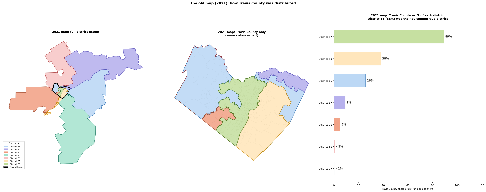
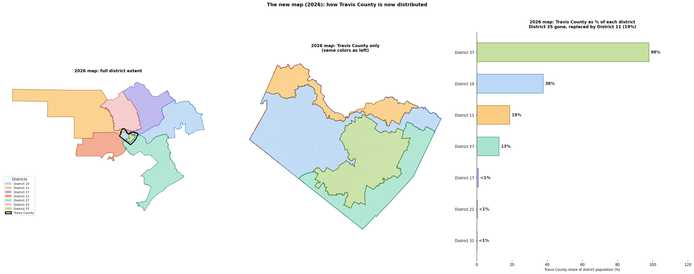
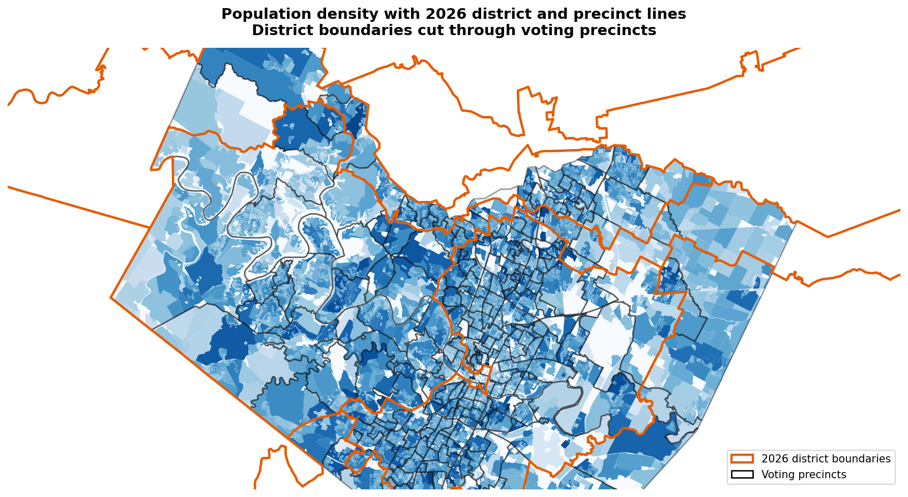
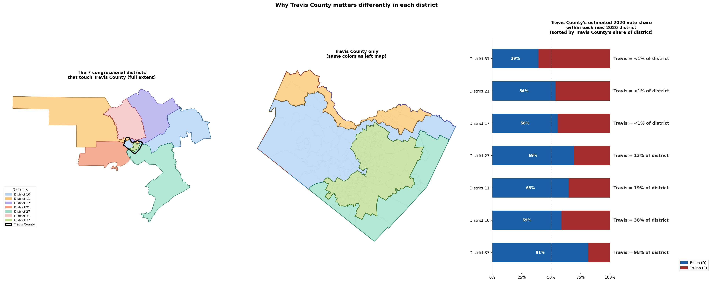

# Methodology

> **Note:** This document reflects the completed Travis County pilot methodology. Minor refinements may continue. If you have questions or suggestions, please open an issue.

## The core problem

When states redraw their political maps, directly comparing election results across cycles becomes challenging. You are looking at different slices of the population each time. A district might appear more Republican or Democratic simply because different neighborhoods got added or removed, not because of any real shift in how people voted.

This project aims to translate past election results onto current maps so campaigns can see how any district or neighborhood has genuinely trended over time. We are starting with Texas, where a 2025 mid-decade redraw created an urgent need for exactly this kind of historical context.

### Why this matters

By standardizing historical votes onto today's exact district and precinct boundaries, this pipeline gives campaigns three vital advantages:

- Unmasking map changes: quantifies exactly who a new map helps or hurts before a single new ballot is cast.
- Neighborhood-level trends: bypasses years of messy, shifting precinct lines to reveal clear, multi-cycle political trajectories for stable geographic communities.
- Resource precision: stops campaigns from wasting limited time and money based on obsolete boundaries, shifting field strategy from guesswork to evidence-backed analysis.

### Case in Point: Travis County (TX) as a Proof of Concept

To test whether this population-weighting approach works in practice, we applied the logic to Travis County, which underwent notable boundary shifts during the 2025 redistricting cycle. 

Under the 2021 map, Travis County residents made up 38% of District 35's population. This substantial stakeholder share meant Austin-area voters had a meaningful, concentrated voice in that district. 

In the 2026 map, District 35 was eliminated. It was replaced by District 11, where Travis County's share of the population drops to just 19%. By running the census-block intersection on these two map iterations, we can see the exact mechanics of the shift: a massive portion of the county's population was concentrated into a single district (District 37, which became 98% Travis County), while its footprint in the surrounding districts was minimized.

Using Travis County as our initial test case allows us to verify that the spatial math can successfully isolate and quantify these structural shifts before trying to scale the logic statewide.

## Two approaches: area-weighted vs population-weighted

When congressional lines are redrawn, the new district boundaries almost never align perfectly with historical voting precincts. When a precinct is split down the middle by a new district line, you have to decide exactly how to divide its historical votes. There are two primary ways to do this.

The baseline approach is area-weighted interpolation: if 70% of a precinct's land area falls inside District A, you give District A 70% of the votes. This is easy to calculate but frequently incorrect. Land does not vote, people do. A precinct that is 70% empty parkland or uninhabited commercial zoning and 30% residential neighborhood should not have its votes split 70/30. 

The better approach is population-weighted interpolation, which is what this project uses. Instead of splitting votes by land area, we split them by where residents actually live. We use Census block population counts to calculate the exact fraction of a precinct's population that falls inside each new district, and use those population fractions to allocate the historical votes.

The result is a much more accurate estimate of how a new district configuration would have performed in a past election.

## How it works: a step-by-step example

To illustrate the methodology, imagine a simplified county with three precincts and two new congressional districts. The calculation follows a four-step pipeline.

**Step 1 — Gather the three layers**

- **Precinct boundaries**: The historical map configuration used to record past election results.
- **Congressional district boundaries**: The new map configuration targeted for analysis.
- **Census block population counts**: The most granular population data available, providing the underlying distribution of where people live.

**Step 2 — Overlay census blocks onto both maps**

A census block is a very small geographic unit. By performing a spatial intersection, we associate every census block with both its precinct ID and its new target district ID. This spatial join allows us to map exactly which district each block's population belongs to.

**Step 3 — Calculate population weights**

For each historical precinct, we aggregate the population of all census blocks that fall within each new district boundary. Dividing this overlapping population by the total precinct population yields a precise allocation weight.

Example for Precinct 14 (Total Population = 2,000):
- 1,800 residents live in the portion intersecting District B
- 200 residents live in the portion intersecting District A
- Weight for District B: 1,800 / 2,000 = 0.90
- Weight for District A: 200 / 2,000 = 0.10

**Step 4 — Allocate votes and validate**

Finally, we multiply the historical precinct-level vote totals by these calculated population weights to distribute the votes into the new district configurations.

Example for Candidate X in Precinct 14 (Total Votes = 1,200):
- Allocation to District B: 1,200 x 0.90 = 1,080 votes
- Allocation to District A: 1,200 x 0.10 = 120 votes

This process is repeated systematically for every precinct and every candidate, and the results are then summed by district. To pass validation, the aggregate vote totals across the new districts must exactly match the original precinct-level baseline; no votes can be artificially created or lost during the interpolation.

## Key assumptions

**Census blocks are internally homogeneous.** We assume that everyone within a census block votes at the same rate and in the same proportion as the block as a whole. In reality, one side of a block might be an apartment complex and the other a parking lot. The smaller the block, the safer this assumption.

**The 2020 Census accurately reflects who was living in each block at the time of the elections being analyzed.** Population shifts between census years are not captured. A neighborhood that grew rapidly between 2020 and 2024 will have its population underrepresented in our weights.

**Voter turnout is uniform across a precinct.** We allocate votes proportionally to population, not to registered voters or actual turnout. A census block with 500 residents gets 5x the weight of one with 100 residents, even if the smaller block has higher turnout.

## Known limitations and edge cases

**Mid-decade population shifts.** This analysis relies on 2020 Census data to weight maps enacted in 2025 for the 2026 cycle. Rapidly growing residential developments or areas that have shrunk since 2020 are not captured by static census weights. Consequently, historical vote projections for high-growth neighborhoods carry a higher degree of uncertainty.

**Zero-population census blocks.** Blocks containing no residents—such as industrial parks, commercial zoning, or open parkland—are assigned an allocation weight of zero. The pipeline handles this automatically to prevent 0/0 division errors, but it is an important structural constraint to note when auditing the underlying spatial joins.

**Precincts spanning county lines.** The pilot scope is restricted to Travis County. Because administrative data and election results are ingested at the county level, scaling the methodology statewide will require a preprocessing step to handle cross-county precincts.

**Low-population precincts.** Precincts with fewer than 50 residents are highly sensitive to minor geometric discrepancies. A minor clipping error or slight boundary misalignment during a spatial join can disproportionately skew the calculated weight fraction. Results for these micro-precincts should be interpreted with caution.

**Boundary litigation.** The 2026 boundaries (PlanC2333) were subject to legal challenges following a mid-decade redraw. In April 2026, the U.S. Supreme Court finalized the map for the current election cycle. While the lines are locked for 2026, any future court-ordered adjustments for subsequent cycles would require a recalculation of the underlying population weights.

## Data sources

All data used in the Travis County pilot is publicly available and free to download.

### Boundary files

**2020 precinct boundaries**: Texas Legislative Council Capitol Data Portal
https://data.capitol.texas.gov/dataset/precincts
File: `precincts20g_2020.zip`

**2026 congressional district boundaries (PlanC2333)**: Texas Legislative Council Capitol Data Portal
https://data.capitol.texas.gov/dataset/planc2333
File: `PLANC2333.zip`
Note: Enacted by the 89th Legislature, 2nd C.S., 2025. Finalized for the current election cycle following a stay issued by the U.S. Supreme Court.

**2021 congressional district boundaries (PlanC2193)**: Texas Legislative Council Capitol Data Portal
https://data.capitol.texas.gov/dataset/planc2193
File: `PLANC2193.zip`
Note: Enacted by the 87th Legislature, 3rd C.S., and utilized for the 2022 and 2024 elections. Used in this project as the historical baseline for map comparison analysis.

### Census population data

**2020 Census P.L. 94-171 Redistricting File**: U.S. Census Bureau
https://www2.census.gov/programs-surveys/decennial/2020/data/01-Redistricting_File--PL_94-171/Texas/
File: `tx2020.pl.zip`

**2020 Census block geometries and population**: Texas Legislative Council Capitol Data Portal
https://data.capitol.texas.gov/dataset/2020-census-geography
Files: `Blocks.zip` (geometries), `Blocks_Pop.zip` (population and demographics)

### Election results

**2020 Presidential precinct-level results**: Voting and Election Science Team (VEST), Harvard Dataverse
https://dataverse.harvard.edu/dataset.xhtml?persistentId=doi:10.7910/DVN/K7760H
File: `tx_2020.zip`

## Validation approach

Two programmatic checks are executed to confirm pipeline integrity. Both must pass before output data is considered reliable.

### Weight-sum test
For every precinct with a non-zero population, the cumulative weights of its subdivided district fragments must sum to exactly 1.0. If the sum is less than 1.0, population data was dropped; if greater, population was double-counted.

In the Travis County pilot, 245 of 247 precincts passed automatically. The remaining two were zero-population precincts. Because dividing zero by zero produces a null or `NaN` value, the pipeline explicitly catches these edge cases and assigns a static weight of 0.0.

### Vote-preservation test
After distributing precinct-level votes across district boundaries, aggregate vote totals across the entire map must exactly match the original precinct-level totals.

The Travis County pilot demonstrates zero data leakage:
* **Original Biden Votes**: 435,860 — **Estimated**: 435,860 — **Difference**: 0.0
* **Original Trump Votes**: 161,337 — **Estimated**: 161,337 — **Difference**: 0.0

No votes were created or lost during the interpolation process.

### The Analytical Output: Projections onto the Enacted Map
Once validation layers pass, the calculated weights model historical partisan baselines within the newly enacted boundaries.

